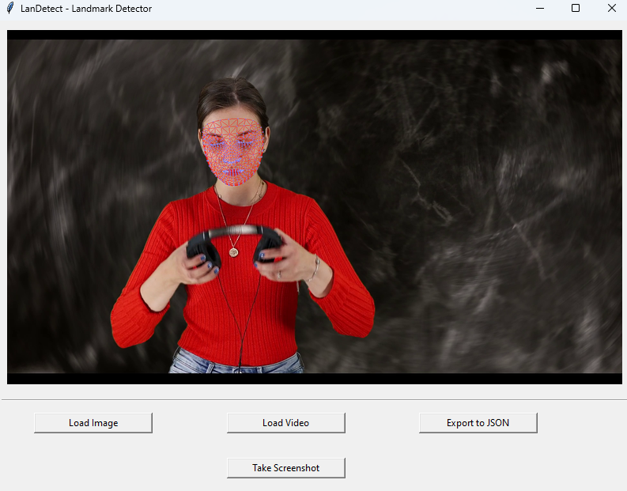
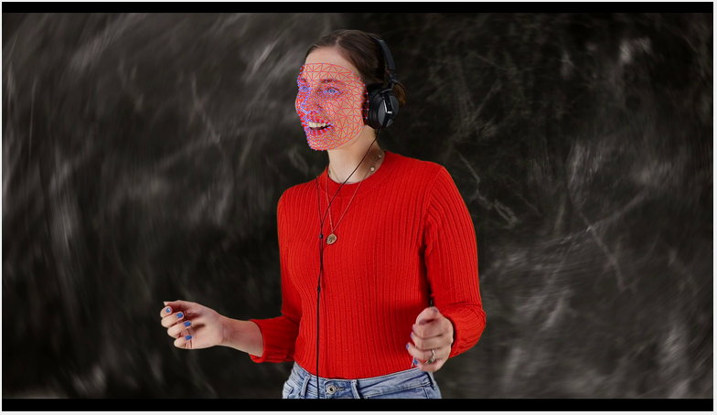

# LanDetect - Landmark Detection Tool

A Python-based application for real-time landmark detection in images and videos.

## Features

- Support for both images and video input
- Real-time facial landmark detection
- JSON export of landmark coordinates
- Multi-face detection capability
- Automatic screenshot capture
- Detailed logging system

## Future Updates

- Support for pose and hand detection
- Export data in multiple formats
- Performance optimizations
- Support for dark theme
- More video controls

## Installation

1. Clone the repository:
```bash
git clone https://github.com/vpakarinen/landetect.git
cd landetect
```

2. Install dependencies:
```bash
pip install -r requirements.txt
```

## Usage

Run the application:
```bash
python main.py
```

### Controls

- **Load Image**: Select an image file for landmark detection
- **Load Video**: Start video capture for real-time detection
- **Export to JSON**: Save detected landmarks to JSON file
- **Take Screenshot**: Capture current view with landmarks

## Screenshots

Here are some examples of the landmark detection in action:






## Support

For support and bug reports, please:

1. Check the logs in the `logs` directory for detailed error information
2. Create an issue in the GitHub repository with:
   - Description of the problem
   - Steps to reproduce
   - Log file contents

## License

This project is licensed under the Apache 2.0 License - see the LICENSE file for details.

## Acknowledgments

- [MediaPipe](https://mediapipe.dev/) for facial landmark detection
- [Pillow](https://python-pillow.org/) for image handling
- [OpenCV](https://opencv.org/) for image processing
