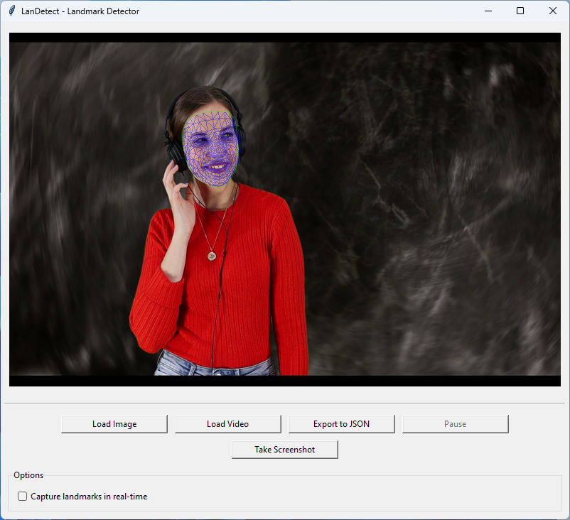

# LanDetect - Landmark Detection

A Python-based desktop application for real-time landmark detection and automatic data extraction.

## Features (v1.0)

- Support for both image and video input
- JSON export of landmark coordinates
- Real-time facial landmark detection
- Multi-face detection capability
- Automatic screenshot capture
- Detailed logging system

## Future Updates

- Support for pose and hand detection
- Extract lips and eyes from the face
- Export data in multiple formats
- Performance optimizations
- Support for dark theme
- More video controls
- Keyboard shortcuts

## Installation

1. Clone the repository:
```bash
git clone https://github.com/vpakarinen/landetect.git
cd landetect
```

2. Install dependencies:
```bash
pip install -r requirements.txt
```

## Usage

Run the application:
```bash
python main.py
```

### Controls

- **Load Image**: Select an image file for landmark detection
- **Load Video**: Start video capture for real-time detection
- **Export to JSON**: Save detected landmarks to JSON file
- **Take Screenshot**: Capture current view with landmarks

## Screenshots




## Support

For support and bug reports, please:

1. Check the logs in the `logs` directory for detailed error information
2. Create an issue in the GitHub repository with:
   - Description of the problem
   - Steps to reproduce
   - Log file contents

## License

This project is licensed under the Apache 2.0 License - see the LICENSE file for details.

## Acknowledgments

- [MediaPipe](https://mediapipe.dev/) for facial landmark detection
- [OpenCV](https://opencv.org/) for image processing
- [Pillow](https://pillow.readthedocs.io/en/stable/) for image handling

## Author
- @vpakarinen
